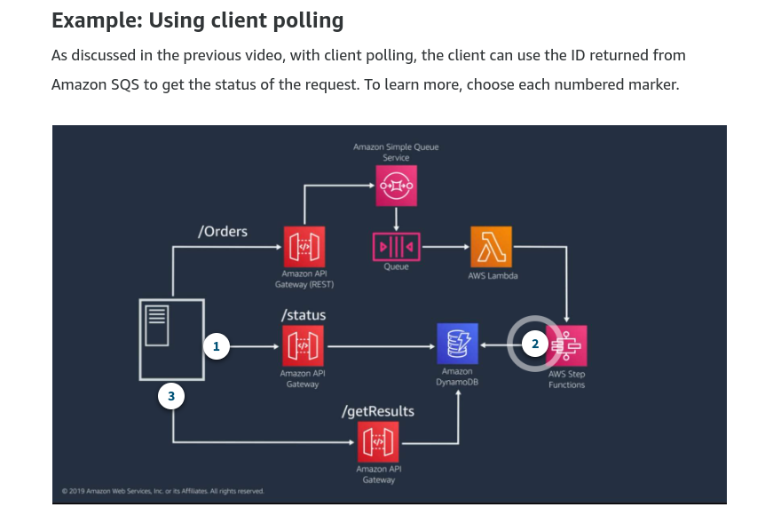
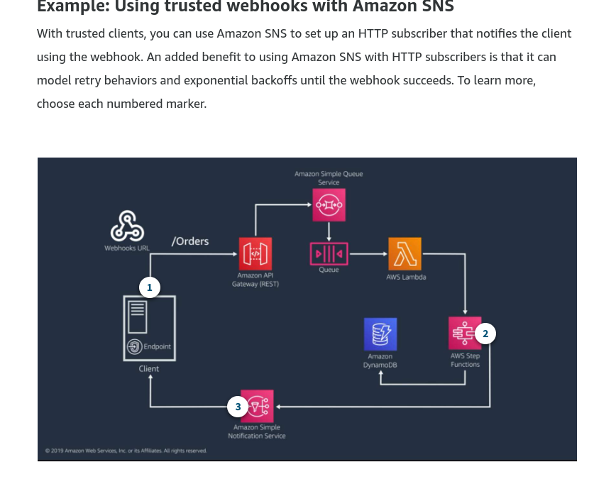
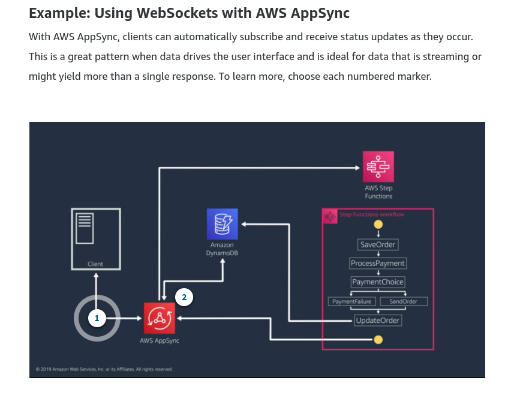

#### Characteristics

- Decoupled state and code
- Event-driven
- Agnostic language

### Amazon SQS Integration with Lambda

| Characteristics    | Standard     | Fifo                     | 
|--------------------| ------------ |--------------------------|
 | Record Order      | Not guaranteed | Guaranteed  per group ID |
| Delivery           | Messages may be delivered more than once | Messages are delivered once and remain in the queue until a consumer processes and deletes them |
| Transaction Throuhgput | Unlimited messges per second | FIFO queue support up to 300 messages per second, 

#### Step Function

#### Patterns combinations to update state

- Client Polling

Advantages

- Convenient to replace a synchronous flow

Disadvantages

- Add additional latency to the consistency of the data to the client
- Unnecesary work and increased cost for requests that are not needed (nothing changes)

- Webhook pattern with amazon SNS

Advantages

- No polling

Disadvantages

- Client must be able to receive and process the notification

- WebSocket pattern with AWS AppSync

Advantages

- Clients receive updates in real time

Disadvantages

- Client must use graphql

### Serverless Data Processing Patterns

- Data processing with Amazon Kinesis

Ingest and processing data in real time

| ShardLImit | Writes  | Reads                                            |
| ---------- | ------- |--------------------------------------------------|
| Rate       | 1000 records per second | 5 transactions per second , up to 10 000 records |
| Data       | 1 mb per second | 2 mb per second                                  |

TOtal shard capacity 

4 000 MB per second = (1000  * )  S
s = shards
s = 4 

