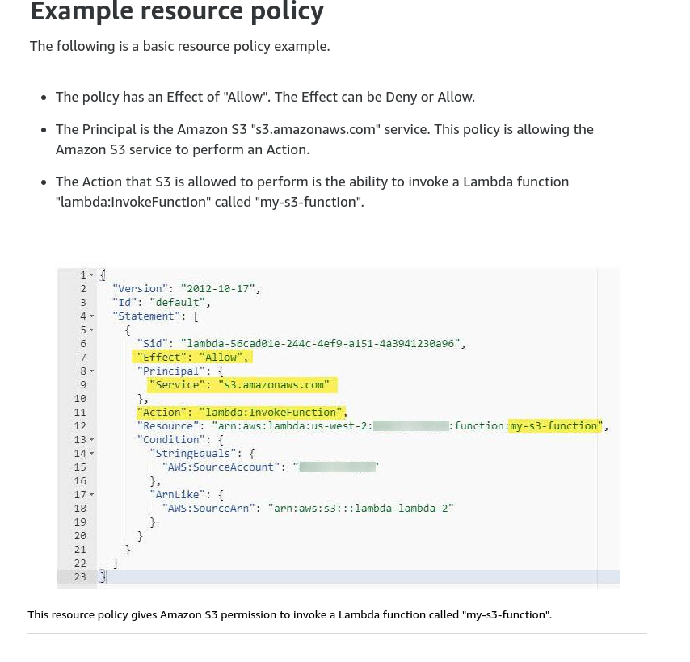

#### AWS Lambda definitions

#### Difference IAM Resource Policy and IAM Execution Role

- IAM Resource Policy: Permission to invoke the funciton
- IAM Execution Role: Permission to access AWS resources

#### IAM Resource Policy

    Associated with a "push" event source such as Amazon API Gateway
    Created when you add a trigger to a lambda function
    Allows the event source to take the lambda:InvokeFunction action

#### IAM Execution Role

    Role selected or created when you create a lambda function
    Trust Policy that allows Lambda to AssumeRole
    Creator must have permission for iam:PassRole

#### Example Resource Policy

#### Runtime lambdas

- Node.js
- Java
- Python
- C#
- Go
- PowerShell
- Ruby

#### Concurrency

- Unreserved concurrency:

The amount of concurrency that is not allocated to any function. This is the amount of concurrency that is available for new functions or functions that have had their concurrency settings changed.

- Reserved concurrency:

Guarantee the maximum number of concurrent instances for the function.
When a function has reserved concurrency no other function can use that
concurrency. No charge is incurred for configuring reerved concurrency for a
function.

- Provisioned concurrency:

Initialize a requested number of runtime environments so that they
are prepared to respond inmediately to invocations.

#### Reason for setting concurrency limits

- Limit concurrency

Limit costs
Regulate how long it takes you to process a batch of events.
Match it with a downstream resource that cannot scale as quickly as Lambda

- Reserve concurrency

Address invocations errors
Ensure that you can handle peak expected volume for a critical function.

#### Versioning, Publish, Aliases

- Versioning
  Lambda creates a new version of your function each time that you
  publish the function. The new version is a copy of the unpublisehd version
  of the function.

- Publish

Publish makes a snapshot copy of $LATEST

Publish as many versions as you need.
Each version results in a new sequential version number.
Add the version number to the function ARN to reference it.
The snapshot becomes the new version and is immutable.

- Aliases

A Lambda alias is like a pointer to a specific function version.

